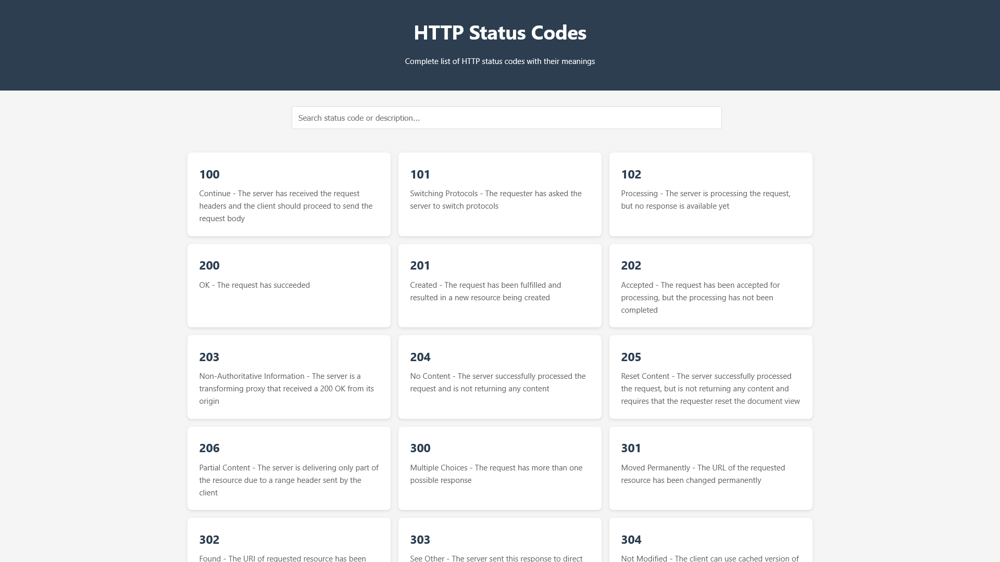

# HTTP Status Codes Reference Website

 <!-- Add a screenshot later -->

A modern, minimalist web application that provides a complete reference of all HTTP status codes with detailed descriptions. Built with HTML, CSS, and JavaScript.

## Features

- **Complete HTTP Status Codes**: Includes all standard HTTP status codes from 1xx to 5xx
- **Detailed Descriptions**: Each status code comes with a clear explanation of its meaning and usage
- **Search Functionality**: Quickly find status codes by number or description
- **Responsive Design**: Works perfectly on both desktop and mobile devices
- **Modern UI**: Clean, minimalist interface with smooth animations
- **Category Grouping**: Status codes are organized by their categories (Informational, Success, Redirection, Client Error, Server Error)

## Technologies Used

- **HTML5**: Semantic markup for accessibility and SEO
- **CSS3**: Modern styling with Flexbox and Grid layout
- **JavaScript**: Dynamic content loading and search functionality
- **Responsive Design**: Media queries for optimal viewing on all devices

## Installation

1. Clone the repository:
   ```bash
   git clone https://github.com/Prominents/HTTPstatusCodes.git
   ```
2. Navigate to the project directory:
   ```bash
   cd HTTPstatusCodes
   ```
3. Open `index.html` in your browser

## Usage

1. Open the website in your browser
2. Browse through the list of status codes
3. Use the search bar to find specific status codes by number or description
4. Click on any status code card to view more details (future enhancement)

## File Structure 